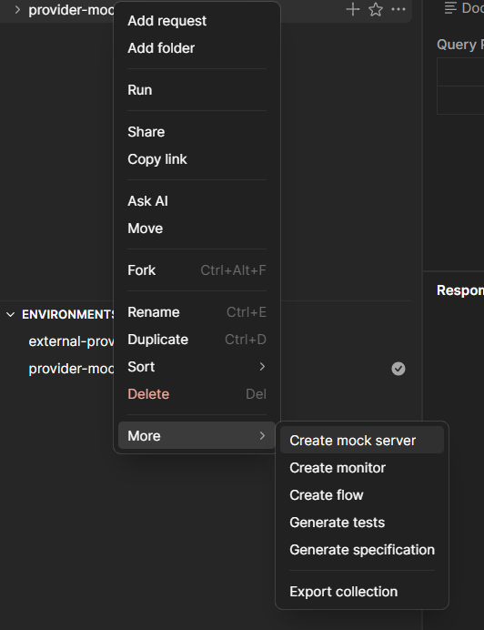
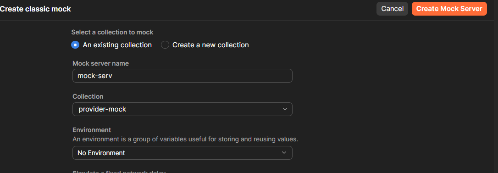
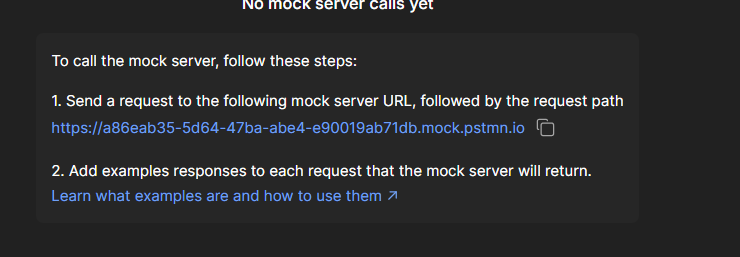

# Transaction Executor
Servicio encargado de validar, procesar y registrar transacciones.

## Stack Técnico
* **Lenguaje:** Java
* **Framework:** Spring Boot
* **Base de Datos:**  Oracle
* **Mensajeria:** Json

## Arquitectura
El diseño del servicio se estructura bajo un patrón de arquitectura en capas, distribuyendo las responsabilidades de la siguiente manera:
* Controller: Actúa como el punto de entrada, publicando los endpoints de la API REST.
* Service: Centraliza y ejecuta todas las reglas de negocio del sistema.
* Repository: Maneja la persistencia y abstrae por completo las operaciones de la base de datos.
* HttpProviderClient: Aisla y gestiona las peticiones HTTP hacia el sistema externo, evitando el acoplamiento.

## Decisiones de diseño
La adopción de este diseño estructurado en capas y componentes especializados responde a la necesidad de construir un sistema mantenible, altamente escalable y tolerante al cambio, alineado con las buenas prácticas de la ingeniería de software.

Los pilares fundamentales que respaldan esta decisión son:
1. Separación de Responsabilidades y Bajo Acoplamiento:
Cada componente tiene una única razón para cambiar. Al aislar la exposición de la API (Controller), la lógica central (Service) y el almacenamiento (Repository), garantizamos que las modificaciones en las reglas de negocio no impacten la persistencia ni los contratos de entrada, y viceversa.
2. Depender directamente de APIs externas introduce rigidez y riesgo. Al introducir un cliente dedicado (ProviderClient), se encapsula toda la complejidad del protocolo de comunicación HTTP, las cabeceras, la serialización y la gestión de errores específicos del proveedor. Si el banco o proveedor cambia su API, el impacto se absorbe por completo en esta capa, protegiendo la lógica de negocio central de alteraciones.
3. Facilidad de Pruebas Unitarias (Mocking): Al estar el sistema claramente dividido, es sumamente sencillo realizar pruebas unitarias sobre la lógica de negocio (Service) inyectando dobles de prueba (Mocks) del Repository y del ProviderClient. Esto asegura una alta cobertura de código sin necesidad de levantar bases de datos ni realizar conexiones de red reales durante los tests unitarios.

## Requisitos Previos
* [Amazon Corretto 21](https://docs.aws.amazon.com/corretto/latest/corretto-21-ug/downloads-list.html)
* [Gradle 8.5](https://gradle.org/releases/)
* Docker & Docker Compose (Instalados y en ejecución).
* Cliente de Base de Datos para la configuración inicial de Oracle.

## Configuración YML
* En la ruta se tiene ubicado [el archivo de configuración](src/main/resources/application-local.yml) del proyecto donde se podrán no solamente configurar propiedades de configuración del servicio como la conexión a la base de datos u otras opciones.
* En este archivo tendremos configuro el **API KEY** generada para la autentifación en el servicio, sin este api key no podremos consultar los servicios desde el swagger.
* Tambien tenemos la posibilidad de configurar las diferentes operativas como el monto maxímo permitido para operaciones con tarjeta de DEBITO (**business.rules.debit-max-amount**) , como las monedas aceptadas en el sistema (**business.rules.allowed-currencies**), esto para que si en algún momento se requiere la modificación de esto no se requiera una nueva build del proyecto. Solamente cambiar configuración y reiniciar los servicios para que tome esta nueva configuración.
* Tambien tenemos la posiblidad de modificar las propiedades de resiliencia (**resilience4j**).

## Configuración Inicial
1. **Clonar el repositorio:**
```bash
   git clone https://github.com/Edson19-coder/transaction-executor
```
2. **Archivo de configuración para despliegue local:** Se debe de generar un archivo local de configuración en la carpeta resource del proyecto, esto base al archivo de despliegue de desarrollo: [transaction-executor-local.yml](src/main/resources/application-local.yml)
3. **Build:** Generar jar de la aplicación previamente con gradle:
```bash
    gradle build
```
4. **Iniciar proyecto:** Ubicarse en la carpeta del jar generado y ejecutar jar con el perfil deseado:
```bash
    java -jar -Dspring.profiles.active=local transaction-executor-0.0.1-SNAPSHOT.jar
```
### Configuración Previa de la Base de Datos
La aplicación requiere un usuario exclusivo con permisos para ejecutar los scripts y paquetes almacenados. Sigue estos pasos en tu instancia de Oracle:
1. **Conéctate como administrador (SYS AS SYSDBA).**
2. **Ejecuta el siguiente script para crear el usuario y otorgar los permisos necesarios:**
```bash
   -- 1. Crear el usuario/esquema
    CREATE USER USER_APP IDENTIFIED BY "Password123";
    
    -- 2. Otorgar permisos básicos de conexión y desarrollo
    GRANT CONNECT, RESOURCE TO USER_APP;
    GRANT CREATE VIEW, CREATE SEQUENCE TO USER_APP;
    
    ALTER USER USER_APP QUOTA UNLIMITED ON USERS;
```
3. Ejecutar la creación de la [tabla](db/tables/T_TRANSACTIONS.pls) en tu gestor de base de datos.
4. Ejecutar la creación del [paquete](db/pkgs) en tu gestor de base de datos.

### Mock
Sigue los siguientes pasos para implementar el mock que funcionara como el proveedor de servicio:

1. Importar el archivo postman adjunto en la carpeta [mock](mock/provider-mock.postman_collection.json) del proyecto
2. Dar click derecho y dar a la opción de "Create mock server"
   
3. Asignamos un nombre a nuestro mock server.
   
4. Copiamos la url que nos asignan los servicios de postman y la cambiaremos en el [archivo yml](src/main/resources/application-local.yml) en la propiedad **app.config.rest-client.provider.baseUrl**
   

## Swagger
Una vez que la aplicación esta arriba puedes interactuar directamente con los endpoints de la API de forma visual.
* Abre tu navegador e ingresa a: http://localhost:9001/swagger
* Desde aquí podrás ver la estructura de cada endpoint, los modelos de datos requeridos y probar peticiones en tiempo real haciendo clic en el botón "Try it out".
